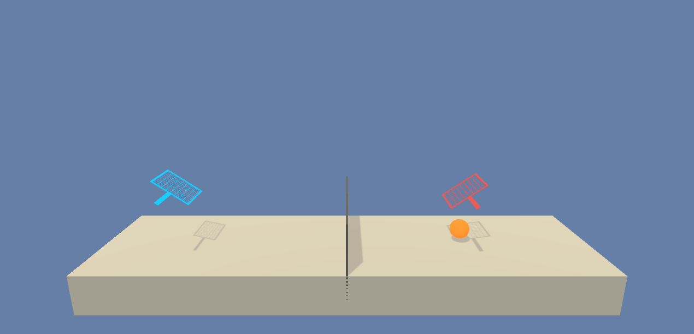
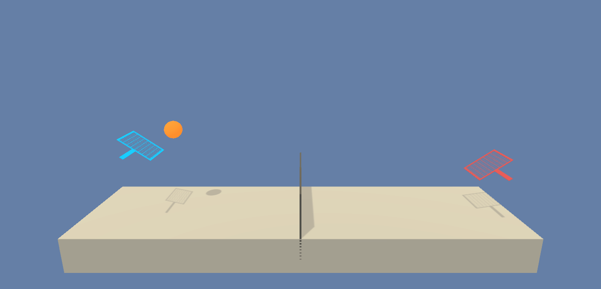
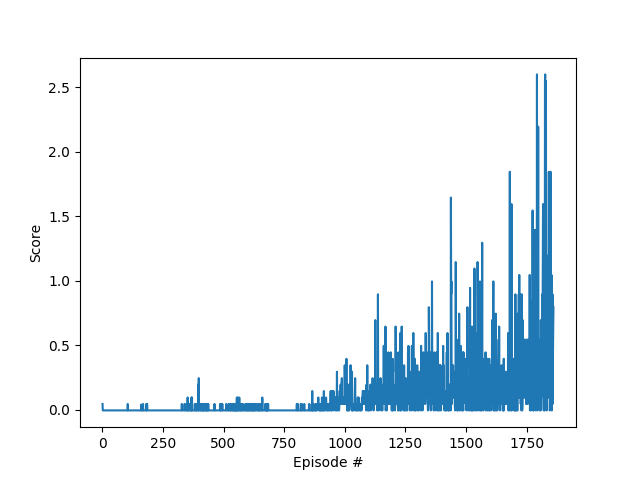

## Project 3 : Collaboration and Competition

Author : Santosh Shukla

This project is implements Multi Agent Deep Deterministic Policy Gradient Network(MADDPG). The deep neural network has following layers:

#### Actor
    1st Fully connected layer - input: 24 (state size) output: 512 (ReLU Activation)
    2nd Fully connected layer - input: 512 output 512 (ReLU Activation)
    3rd Fully connected layer - input: 512 output: 2 (action size) (Tanh Activation)

#### Critic
    1st Fully connected layer - input: 24 (state size) output: 512 (ReLU Activation)
    2nd Fully connected layer - input: 512 + 2 (action_size) output 512 (ReLU Activation)
    3rd Fully connected layer - input: 512 output: 1 (Linear Activation)

### MADDPG Algorithm
Multi Agent Deep Deterministic Policy Gradient, also known as MADDPG, is an off policy algorithm. The system architecture is based on Actor Critic based framework. The actor takes states of the system as inputs and outputs the action to be taken. The critic takes both states and actions as input and outputs the Q-value for the state-action pair.

Parameters used in MADDPG algorithm:

    Learning Rate: 3e-4
    Batch Size: 256
    Tau: 1e-3
    Gamma: 0.99
    Replay Buffer: 1e6
    
The task is episodic, and in order to solve the environment, the agents must get an average score of +0.5 (over 100 consecutive episodes, after taking the maximum over both agents). Specifically,

- After each episode, we add up the rewards that each agent received (without discounting), to get a score for each agent. This yields 2 (potentially different) scores. We then take the maximum of these 2 scores.
- This yields a single **score** for each episode.

Following is how an untrained agent performs in the Unity Environment

When the agent is trained, following is the behavior 

### Graphs

MADDPG algorithm was implemented, the environment is solved in 1861 episodes

### Future work
To try out the following:
- Prioritized Experience Replay
- Hyperparameter Optimization
- Testing other algorithms like PPO
